# Project: Birds records analysis from Mexico 

Francisco Javier Gutierrez-Martinez
v2024.02

## Abstract
[TOC](#TOC)

## Table of content

- [Project: Birds records analysis from Mexico](#project-birds-records-analysis-from-mexico)
  - [Abstract](#abstract)
  - [Table of content](#toc)
  - [Technical and source information](#technical-and-source-information)
    - [Database](#database)
    - [Shape files](#shape-files)
    - [Software](#software)
  - [Disclaimer](#disclaimer)
  - [Scope](#scope)
  - [Data exploration](#data-exploration)
  - [Results](#results)
  - [Conclusion](#conclusion)

 

 

## Technical and source information

### Database
[TOC](#TOC)
- Description: Database birds record identified in United Mexico States between the years 1750 to 2022. 
- Source: [CONABIO](https://www.gob.mx/conabio) 
- Sources: [Landing page data] | [Database_birds] | [Metadata]
- Format: CSV
- Published: 07-02-2024 [07-february-2024]
- METADATA 
    - Published: 07-02-2024
- Shape:
    - 21,561,538 : 67
- Size: 573 MB
    - Format: parquet
    - <i>Comments: The final database size describe above is after filtered. Uncompressed original csv file size is
        around 27 GB</i>

[Landing page data]: http://geoportal.conabio.gob.mx/metadatos/doc/html/aves.html
[Database_birds]: https://www.snib.mx/ejemplares/aves.202305.csv.zip
[Metadata]: http://geoportal.conabio.gob.mx/metadatos/doc/fgdc/aves.zip

### Shape files
[TOC](#TOC)

- United Mexican States Map
    - Description: map of [United Mexican States] and political division (32 states)
    - Source: CONABIO
    - Format: ESRI shape file
    - [Map UMS UTM]
- Municipalities from United Mexican States
    - Description: [municipalities political division]
    - Source: CONABIO
    - Format: ESRI shape file
    - [Map mun UTM]
- Continents
    - Description: [Continents map]
    - Source: ESRI hub
    - Format: ESRI shape file
- Continuo de Elevaciones Mexicano (CEM)
    - Description: [DEM file]
    - Source: INEGI
    - Format: TIFF

[United Mexican States]:http://geoportal.conabio.gob.mx/metadatos/doc/html/dest2019gw.html
[Map UMS UTM]:http://www.conabio.gob.mx/informacion/gis/maps/geo/dest2019gw.zip
[municipalities political division]:http://geoportal.conabio.gob.mx/descargas/mapas/imagen/96/mun21gw
[Map mun UTM]:http://www.conabio.gob.mx/informacion/gis/maps/geo/mun21gw.zip
[Continents map]: https://hub.arcgis.com/datasets/mpmkr::continents/about
[DEM file]: https://www.inegi.org.mx/app/geo2/elevacionesmex/

### Software
[TOC](#TOC)
- Docker desktop 27.3.1
    - Conda 24.9.1
    - Pyspark 3.5.3
    - python 3.11.10
    - pandas 2.0.3
    - matplot-base 3.9.2
    - seaborn-base 0.13.2
    - Jupyterlab 4.2.5
- QGIS Desktop 3.34.11
- git 2.47.0

## Disclaimer
[TOC](#TOC)

This is a personal project involving the analysis of a bird observation database for academic, research, and testing 
purposes. In this context:

- This report has not undergone peer review, nor has it been rigorously checked for style or grammar.
- The content, including plots, queries, and the report itself, is subject to change in future versions. Remember,
this is a personal project released for public viewing.
-It can serve as an introductory reference for further research on bird populations in Mexico. However, for precise
or detailed inquiries beyond this project's scope, please refer to the original dataset.
- There may be minor errors or inconsistencies in text, data, and visualizations, which will be corrected in future
updates as needed.

<b>Liability Limitation:</b> The author assumes no responsibility for any decisions, actions, or interpretations
made based on this report. It is provided "as-is" without any guarantees of accuracy or completeness.

<b>Acknowledgment of Preliminary Nature:</b> This project is a work-in-progress and is not intended as a final,
authoritative source. Future versions may improve upon any existing errors, data representations, or interpretations.

<b>Note:</b> This project reflects an ongoing interest in the subject and is not intended to serve as a definitive
paper.

## Scope
[TOC](#TOC)

The report focuses on general information about bird species in Mexico. In this context:
- The United Mexican States (Mexico, henceforth) is the main and sole country analyzed for bird records.
- The statistics are general; they do not include machine learning (ML) projections about population trends or
cross-references with other datasets.
- GIS files are created to plot and analyze behaviors, records, and general information.

## Data exploration
[TOC](#TOC)

According to the biology, the birds classification using taxonomy goes from kingdom, to phylum, to class, to order,
to family, to genus, to species. This classification is used focus in the _"specie"_ feature as key to filter dataset
from CONABIO. The taxonomy data from this dataset is:
- Kingdom: Animalia
- Phylum: Chordata
- Class: Aves
- Order: [29](./query/query_ordenvalido)
- Family: [109](./query/query_familiavalida)
- Genus: [552](./query/query_generovalido)
- Species: [2930](./query/query_especievalida)

### Species identifieds
Bird record geographically from 33 states and 2174 municipalities from Mexico. From 2930 birds species identifieds,
three first state with highest species records are: Chiapas, Oaxaca, Veracruz de Ignacio de la Llave. Versus
Guanajuato, Aguascalientes and Tlaxcala, the lowest records of birds in the sates. This information gives general
view about the biodiversity in the country, relate it with the environment present in each place.
Meanwhile the number or record of birds in general the first three states are: Veracruz de Ignacio de la Llave,
Chiapas and Nayarit. The lowest record of birds is Aguascalientes, Tlaxcala and Zacatecas.
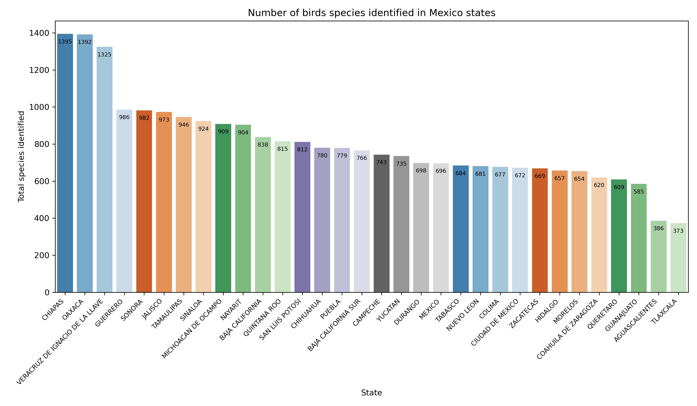  

Visually, the species location in Mexico is showing in the map grouped by state. The [PBRA-SBI-1] folder contain the
dataset.
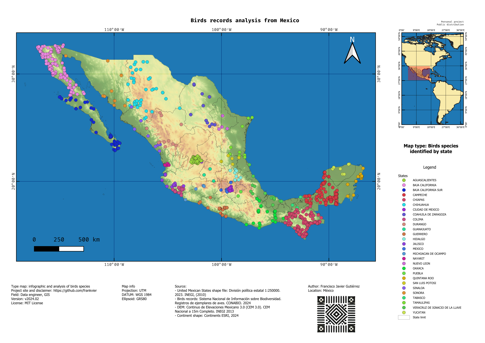

[PBRA-SBI-1]:queries/total_unique_species_by_states

### Common name
The birds species identified according to taxonomy can be added a new feature, the _"common name"_. Requesting this
feature to the persons, gives information about lossing the names of birds, changing or forgeting. Showing the
importances gives the people to the environment and biodiversity. Some local knowledge can be resqueted or just going
to lossed. The importance of resqueted must be evaluated by multidisciplinary team included local specialists,
the scope, goals and final use of the information.

The analyzed dataset about the common names gives the three main name identified in the records, which are:
Zanate mayor, zopilote aura and paloma alas blancas; the less common name are: petrel de Bulwer, lavandera amarilla,
golondrina grande and other birds species identifieds with less two records. [PBRA-SBCN-1]  

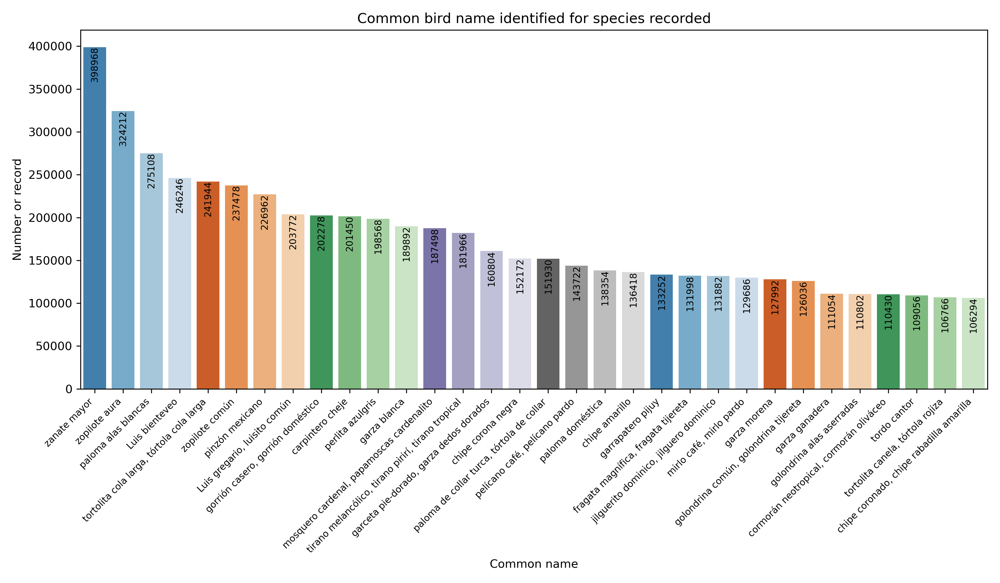

The birds common name analyzed cover Mexico, the map showing the unique location of names where was identified in the
projects for birds observations.
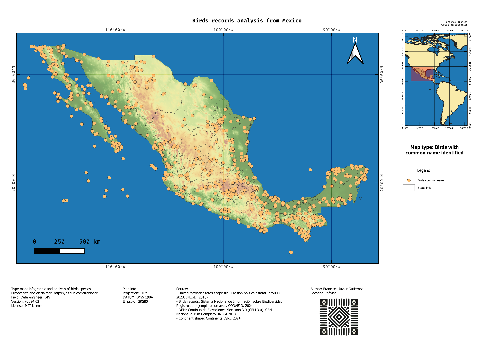

**Note:** The common name for two or more species can be same, because the people identified the birds like unique, or
by lossing the knowledge about to recognize birds species.

[PBRA-SBCN-1]:queries/total_recorded_species_common_name

### Environments
Consider environment as the place where is common to found the birds, startin in highest mountains to the coast.
In Mexico has identified 8 environment, in the table showing the number species recorded in each one.

|Environment                   |Species identified   |
|------------------------------|---------------------|
|Terrestre                     |832                  |
|Dulceacuícola                 |38                   |
|Dulceacuícola; Terrestre      |11                   |
|Marino; Salobre               |9                    |
|Marino                        |7                    |
|Dulceacuícola; Marino; Salobre|2                    |
|Dulceacuícola; Salobre        |2                    |
|Dulceacuícola; Marino         |1                    |

The query show mainly land birds in the dataset, which are common identified in birds observations, including 
"Dulceacuícola" and "Dulceacuícola; Terrestre " environment, with less records is "Dulceacuícola; Marino" environment
with just one specie. In a way this result showing where put more effort for research and identified the reason of this
behavior of data.  
The first three state with eight environments are: Quintana Roo, Guerrero, Nayarit. State with less environments (3)
are: Aguascalientes, Tlaxcala and Morelos.

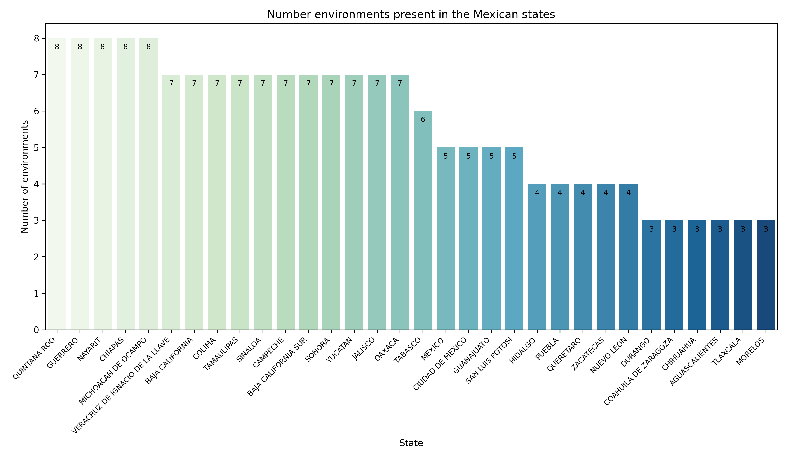

The total number of records by state with environment validated is showing in the plot. Considering the information it
can be assumed high participation of the people, academic projects or long time running civil observation birds
projects.

Until now, the birds information show different variables must be to considering to following birds research, a
technique can be added is the crossing the data about the environments and birds species. Stacking the data gives
visual output about the main environments in the states with more species identified. [PBRA-SBSE-1]  
  
According to the plot, Oaxaca, Chiapas and Veracruz de Ignacio de la Llave are the main states with birds species
identified in the environments listed. As show in the above table "Terrestre" and "Dulceacuícola" are predominant. The
left categories in minus scope and diversity.

[PBRA-SBSE-1]:queries/total_unique_species_by_state_environment

### Endemic birds species
Considering endemic species like "something is restricted to a specific geographic area and is not found naturally
anywhere else in the world."[[sciencedirect endemic]] Applying the definition to birds, is linked to a place. For
dataset analysis present three modes: cuasiendémica, semiendémica, endémica. The first one are the species which cross
the geographic limit defined for the bird of [35 km^2^]. Semiendémica are temporal species identifieds in a place and
change location in seasons, migration birds. Endémica, is a species located in a specific geographic area.  
In the dataset the endemic birds species are concentrate in this way [[PBRA-SBEN-1]]:

|    Endemism |    Species    |
|-------------|---------------|
|Cuasiendémica|             42|
| Semiendémica|             45|
|     Endémica|            178|

Considering this information, the endemic distribution in Mexico by state is how showing in the plot.

Complementary to the distribution of endemic birds, the next map showing the main location of the species in the 
country, there can view the geographic area of the records. The points are unique bird species, not is a way to show
bird motion in the places, just a guide where are located.

Crossing data of endemic birds (endémica) and environments, show four states with more endemic birds: Oaxaca, Jalisco,
Guerrero and Michoacán de Ocampo. With less endemic are: Baja California, Campeche and Tabasco. Majority of the species
are land birds, just a few birds identifieds in others. [[PBRA-SBEBSE-1]]

[PBRA-SBEN-1]:queries/endemic_species_by_state
[sciencedirect endemic]:(https://www.sciencedirect.com/topics/earth-and-planetary-sciences/endemic-species#:~:text=In%20subject%20area:%20Earth%20and,Ecology%2C%20Evolution%20and%20Systematics%2C%202010)
[35 km^2^]:https://www.gob.mx/profepa/articulos/especies-endemicas-en-mexico-237094?idiom=es#:~:text=Las%20cuasiendémicas%20rebasan%20los%20límites,de%2035%20mil%20kilómetros%20cuadrados.
[PBRA-SBEBSE-1]:queries/endemic_species_by_state_environment

### Exotic-invasive birds species

In Mexico there is fourteen exotic-invasice species, from the total, just two are not identified with common name. The
species exclude are: _Cyanoliseus patagonus, Psittacula krameri_.

|Valid specie            |Common name                              |Total record|
|------------------------|-----------------------------------------|------------|
|Passer domesticus       |gorrión casero, gorrión doméstico        |202278      |
|Streptopelia decaocto   |paloma de collar turca, tórtola de collar|151930      |
|Columba livia           |paloma doméstica                         |138354      |
|Bubulcus ibis           |garza ganadera                           |111054      |
|Sturnus vulgaris        |estornino pinto                          |32046       |
|Myiopsitta monachus     |perico monje argentino                   |22242       |
|Phasianus colchicus     |faisán de collar                         |1384        |
|Lonchura malacca        |capuchino tricolor                       |456         |
|Lonchura punctulata     |capuchino pecho escamoso                 |322         |
|Streptopelia roseogrisea|paloma de collar africana                |68          |
|Streptopelia chinensis  |paloma ala dorada, paloma de oriente     |64          |
|Molothrus bonariensis   |tordo común, tordo sudamericano          |22          |
|Cyanoliseus patagonus   |                                         |12          |
|Psittacula krameri      |                                         |6           |

By state the number of exotic-invasive bird species is different, Baja California is the state with high number, with
eleven species, meanwhile Tabasco and Colima with the low number with 5 species. In the plot show the complete series. 
[[PBRA-SBEIS-1], [PBRA-SBEIS-2]]  

[PBRA-SBEIS-1]:queries/exotic_inv_by_state
[PBRA-SBEIS-2]:queries/exotic_birds_by_state_species_commonname

### Residence category
Residence category defined as residence type of birds in a geographic place, by season, observed or recorded. Mexico
present 23 types of residence [[PBRA-SBRC-1], [Plot-Residence_category]]:

|Residence category of birds                                                           |   Species    |
|--------------------------------------------------------------------------------------|--------------|
|Residente (R)                                                                         |902           |
|Migratoria de invierno (MI)                                                           |190           |
|Residente (R); Migratoria de invierno (MI)                                            |179           |
|Accidental (A)                                                                        |55            |
|Transitoria (T)                                                                       |33            |
|Residente (R); Migratoria de invierno (MI); Migratoria de verano (MV)                 |31            |
|Migratoria de invierno (MI); Migratoria de verano (MV)                                |23            |
|Residente (R); Migratoria de verano (MV)                                              |19            |
|Migratoria de invierno (MI); Transitoria (T)                                          |19            |
|Accidental (A); Oceánica (O)                                                          |18            |
|Transitoria (T); Oceánica (O)                                                         |15            |
|Migratoria de verano (MV); Transitoria (T)                                            |13            |
|Residente (R); Oceánica (O)                                                           |12            |
|Migratoria de verano (MV)                                                             |7             |
|Residente (R); Transitoria (T); Oceánica (O)                                          |6             |
|Migratoria de invierno (MI); Migratoria de verano (MV); Transitoria (T)               |5             |
|Migratoria de invierno (MI); Oceánica (O)                                             |4             |
|Residente (R); Migratoria de invierno (MI); Oceánica (O)                              |3             |
|Residente (R); Migratoria de invierno (MI); Transitoria (T)                           |2             |
|Residente (R); Transitoria (T)                                                        |2             |
|Residente (R); Migratoria de invierno (MI); Migratoria de verano (MV); Transitoria (T)|2             |
|Migratoria de invierno (MI); Transitoria (T); Oceánica (O)                            |2             |

The higher number of residence category by state is 22, the lower 13. This information showing in the next plot.
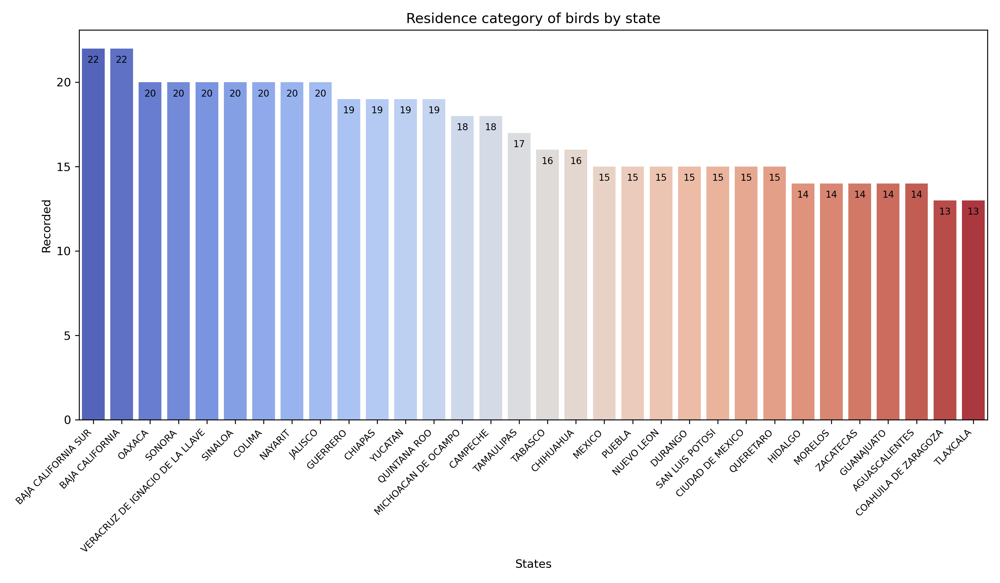
Each state present biodiversity of birds, a reference of good forest conservation, ecosystems and
community participation for birds observation projects. The following map showing the residence category  by specie
identified.  
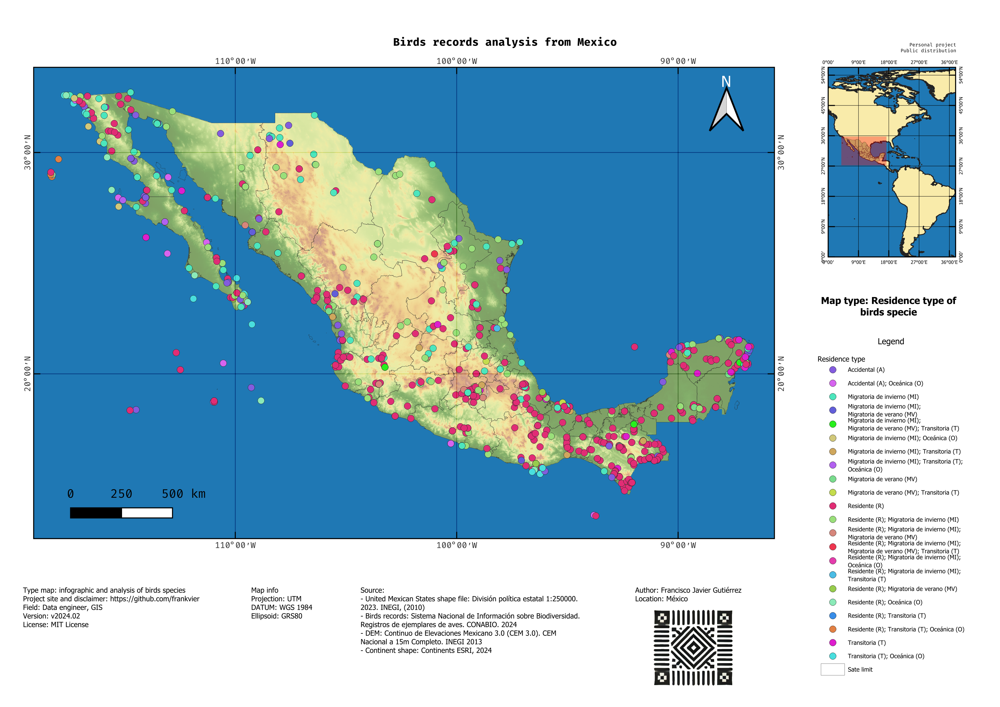

Grouping the residence category by state using the species as key feature, show the trend about the birds in the
places [PBRA-SBRC-BS-1]. Considering the rank in the plot, the first state with high birds record is Veracruz de
Ignacio de la Llave, meanwhile Zacatecas is with low records. [PBRA-SBRC-BSS-1]
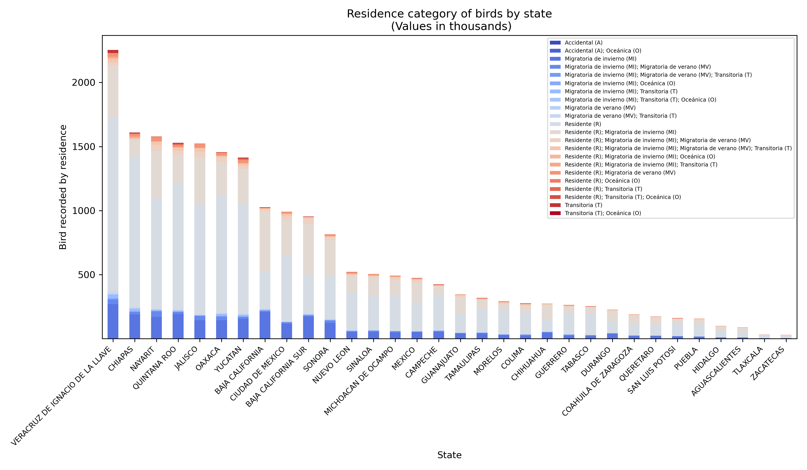  

[PBRA-SBRC-1]:queries/total_residence_birds
[Plot-Residence_category]:plot/residence_birds_total.png
[PBRA-SBRC-BS-1]:queries/resident_type_birds_by_state
[PBRA-SBRC-BSS-1]:queries/residence_birds_by_state_specie_records

### Species with status
Species with status reference as birds with extintion risk, medium level or lower or a specific variant for species of 
interest. The status tag is defined by country government, universities, Non-Governmental Organization (NGO) or
international agreement. For this section considering the Mexico status defined in the list NOM059, the NGO
International Union for Conservation of Nature (IUC) and Convention on International Trade in Endangered Species of 
Wild Fauna and Flora (CITES). Each entity has defined a status list which apply for birds species in Mexico, the total
status show in the table.

|NOM059 status|CITES status|IUCN status|
|-------------|------------|-----------|
|           34|          61|         47|

The scope of species for each list status tag is showing in the table.
|List name | Status tag | Number species |
|----------|------------|----------------|
|NOM059    |          34|             620|
|CITES     |          61|             362|
|IUCN      |          47|            2643|

From the three status list, they share 189 birds specie [[PBRA-BSES-1]]. Visually in map, gives more
geographic reference in the distribution of the species.
 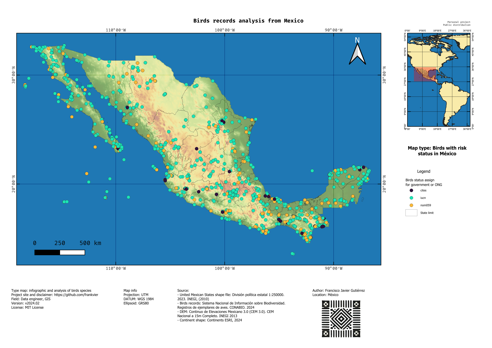

[PBRA-BSES-1]:queries/species_status_shared

### Records by decades
The CONABIO dataset has initial record of birds from 1750 to 2022. Considering the large range of time was grouped by 
decades, getting general information about behavior recording of birds species showing in the next plot. [[PBRA-BSRBD]]
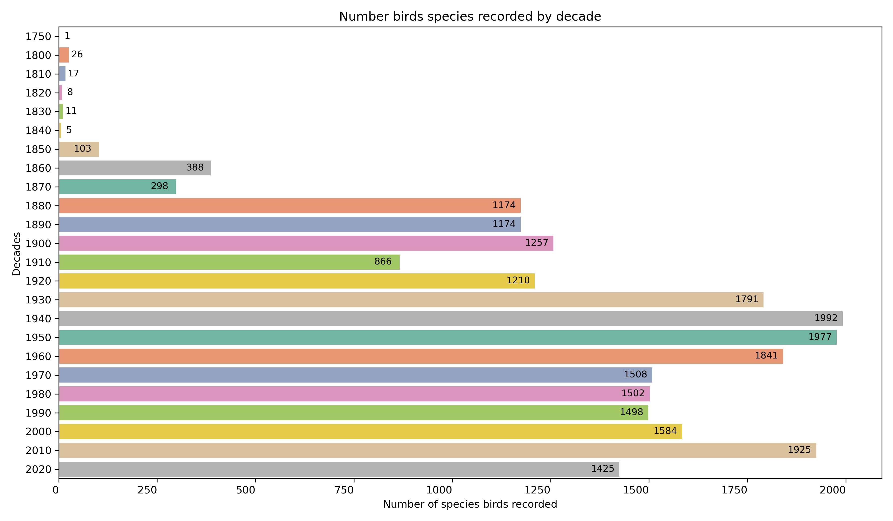

According to the latest plot, bird recordings reached their highest values in the 1940s and 1950s. This data reflects
only the number of bird records, not unique species identified during that period. The trend in bird recordings rose
again in the 2010s, with 1,925 unique species recorded.

Comparing the number of unique species identified per decade with the total number of bird records in the dataset
reveals a peak in the 2010s, with 11,456,000 observations, compared to just 188,654 in the 1940s. While the 2010s saw
1,925 unique species, the 1940s accounted for 1,992. Various factors—such as observer expertise, location,
environmental conditions, and others—may influence these figures.
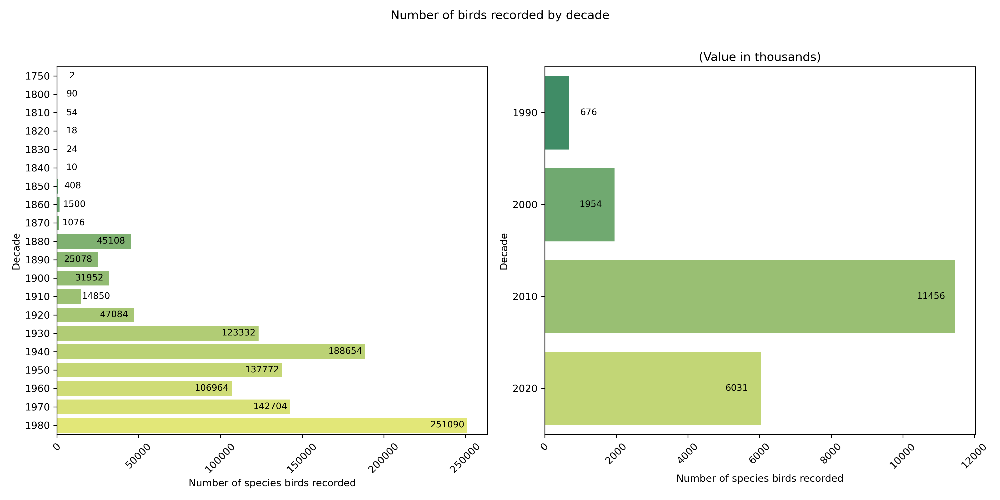

After to saw the record by decades, the months where the records was made is another trend and variable to consider in
field observation. The dataset show a pick in the first three months: january to march, descending the records until 
june, on jule recover the trend increment records to december. [[PBRA-BRRBD-M]]
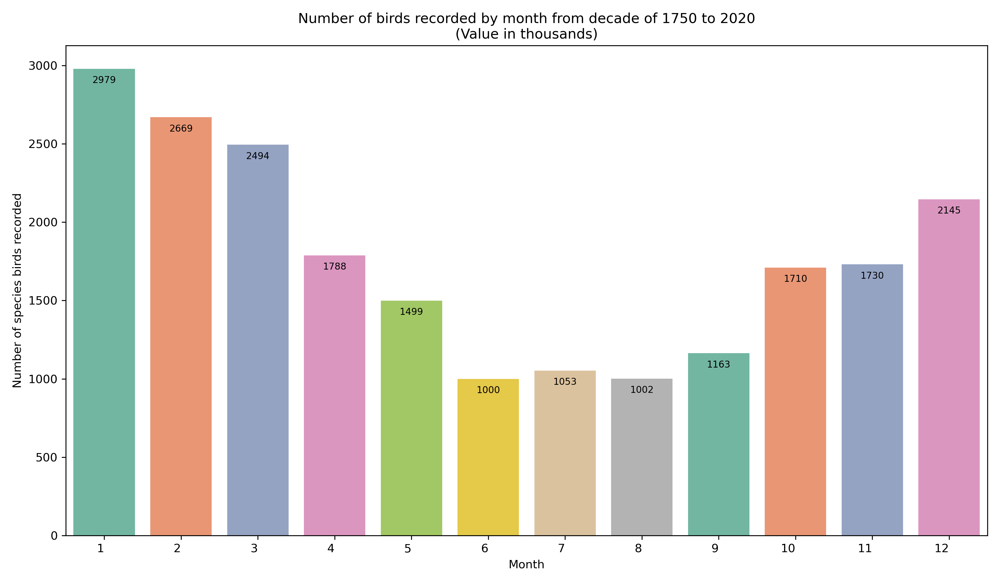

[PBRA-BSRBD]:birds_registry_by_decades
[PBRA-BRRBD-M]:queries/birds_registry_by_decades_months

### Collections
The collections are as books, a registry of bird specie example. The hierarchy in a collection start with the Country, 
to institutes, to collections and to species. In CONABIO dataset has registred this information:

|   COUNTRIES   |   INSTITUTES   |   COLLECTIONS   |   SPECIES   |
|---------------|----------------|-----------------|-------------|
|             25|             110|              157|         2894|

In general, detailing the last table using as main filter the country and sum of the other features we get this 
information:

|COUNTRIES                | INSTITUTES | COLLECTIONS | SPECIES |SPECIES RECORDED|
|-------------------------|------------|-------------|---------|----------------|
|ESTADOS UNIDOS DE AMERICA|53          |81           |2765     |16318140        |
|MEXICO                   |31          |35           |1831     |4226650         |
|HOLANDA                  |3           |3            |1520     |31940           |
|CANADA                   |7           |8            |1513     |243932          |
|REINO UNIDO              |1           |1            |1031     |36914           |
|ESPAÑA                   |3           |3            |560      |11188           |
|FRANCIA                  |3           |3            |558      |4636            |
|PERU                     |1           |1            |354      |2336            |
|ARGENTINA                |1           |1            |331      |3146            |
|TAIWAN                   |1           |1            |299      |1406            |
|AUSTRALIA                |1           |1            |259      |1184            |
|BRASIL                   |3           |3            |251      |1146            |
|PORTUGAL                 |1           |1            |187      |1160            |
|COLOMBIA                 |1           |1            |173      |746             |
|CHILE                    |1           |1            |127      |402             |
|INDIA                    |1           |1            |119      |416             |
|PARAGUAY                 |1           |1            |48       |138             |
|SUECIA                   |1           |1            |22       |310             |
|ALEMANIA                 |5           |5            |19       |46              |
|MALASIA                  |1           |1            |18       |36              |
|NUEVA ZELANDA            |1           |1            |17       |36              |
|DINAMARCA                |1           |1            |13       |56              |
|NORUEGA                  |1           |1            |9        |66              |
|AUSTRIA                  |1           |1            |4        |10              |
|RUSIA                    |1           |1            |2        |6               |

The last table is a general information about the collections, for detailed information for specific species,
collection or any other feature can be check the dataset. [[PBRA-BSCS-1]]

[PBRA-BSCS-1]:queries/collections_country_inst_collection

### Projects
The projects are the way to collect records about the birds in field. Some caracteristics of projects in the dataset
are: not all the projects are linked to a country, institute or collection. This analysis is focus to projects with
birds species validated. Following that directive, in two decades reached the highest values in the 1990s and 2010s. 
The effort to keep the birds observation and registry into collections or institutes, must be found a new way for
effectivenes in time, resources, people, communication and publishing ways accesible. [[PBRA-BSP-1]]
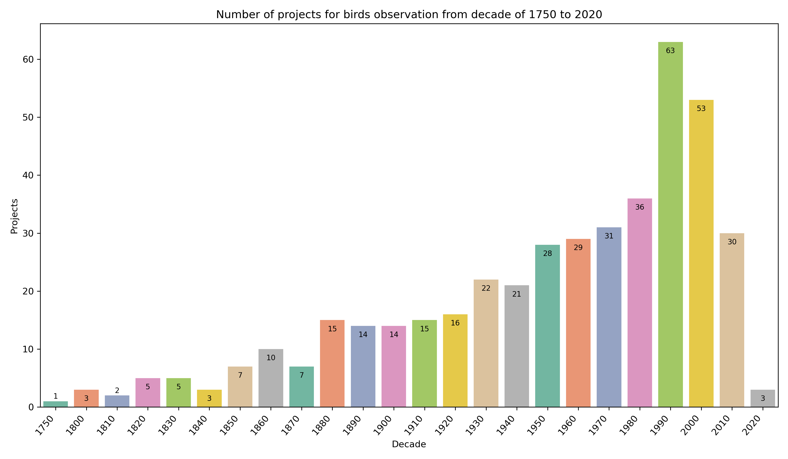

[PBRA-BSP-1]:queries/projects_by_decade

## Results
[TOC](#TOC)

- Number of birds identified is changing according to the number of projects runned and strategy to generate the
information in fields.
- The highest number of records not always mean diversity of species identifieds. The strategy to collect and record
the data must have different approach, include rural location, apply the new ML model available to analysis photos to
fill the missing or NULL values in the dataset.

## Conclusion
[TOC](#TOC)

- The people do not know about the species with some risk status, the lossing the local knowledge about the environment,
the birds name and endemic species. This result is based after cheking the official government website
